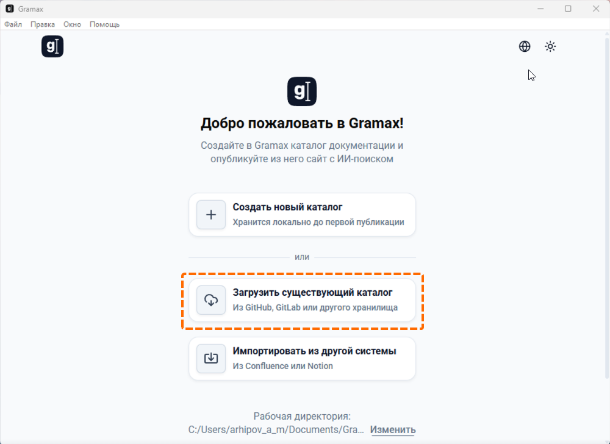
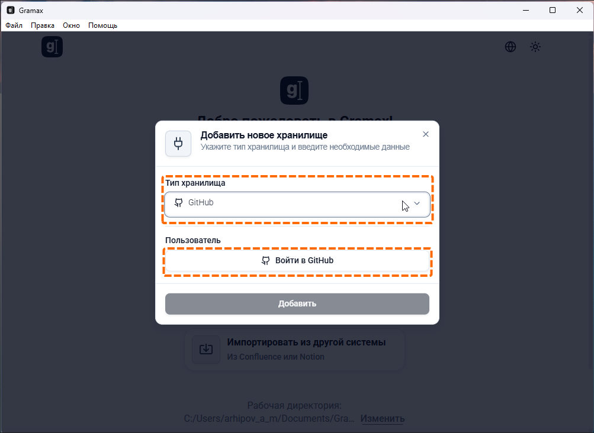
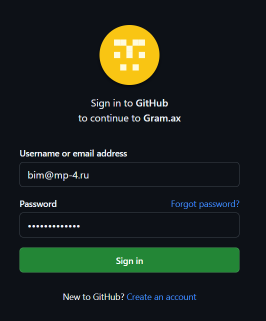
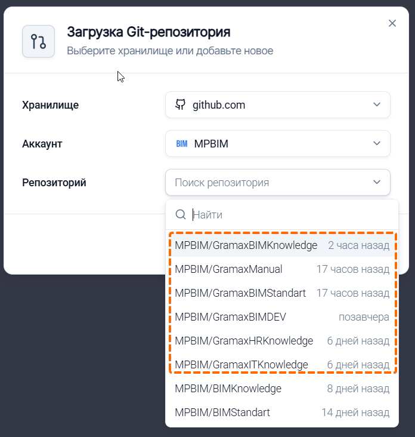
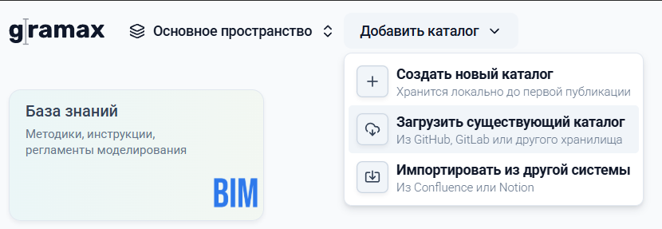
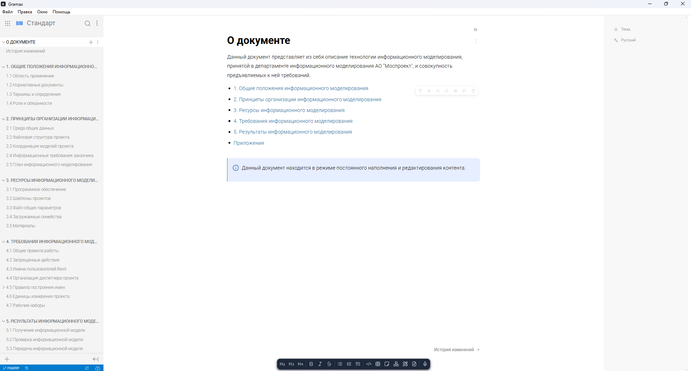

Рекомендуется редактировать отображаемые на портале документации каталоги с помощью **десктопного приложения**, которое можно установить на сайте <https://gram.ax/ru>. После скачивания необходимо установить программу и запустить ее.

:::info 

Редактирование доступно из любой сети, просмотр портала только из внутренней!

:::

Порядок действий для подключения 1 каталога для редактирования:

**Шаг1**. Выбрать «**Загрузить существующий каталог**», т.к. каталоги уже существуют в виде репозиториев на корпоративном GitHub:

{width=1000px height=728px}

**Шаг 2**. Выбрать тип хранилища «**GitHub»** и нажать на «**Войти GitHub»**, чтобы получить доступ к корпоративным репозиториям:

{width=1003px height=732px}

**Шаг 3**.Ввести учетные данные для аккаунта, где расположены репозитории:

-  **логин**: [bim@mp-4.ru](mailto:bim@mp-4.ru)

-  **пароль**: выдается по запросу

-  **подтверждение вторичной аутентификации**: выдается по запросу

{width=532px height=642px}

:::info 

Запросы для получения паролей направлять Смакаеву Равилю.

:::

**Шаг 4**. После получения сообщения о успешном соединении необходимо вернуться в приложение Gramax и повторно нажать на «**Загрузить существующий каталог**». В появившемся окне нужно выбрать GitHub, аккаунт MPBIM и один из необходимых каталогов:

{width=696px height=732px}

:::info 

Все репозитории, предназначенные для работы с Gramax содержат в своем имени слово «Gramax».

:::

**Шаг 5**. Повторить шаг 4 для каждого каталога, который предстоит редактировать:

{width=830px height=287px}

Процедура завершена, каждый добавленный каталог теперь привязан к центральному хранилищу и позволяет [вносить и получать изменения ](./poluchenie-i-vnesenie-izmeneniy)конкретного репозитория GitHub:

{width=1917px height=1030px}