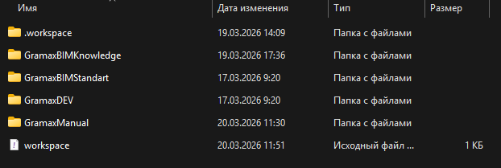
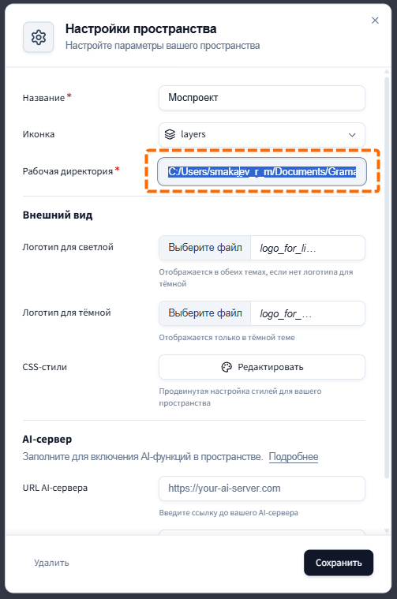

Для того чтобы применить стили оформления и логотипы, отображаемые на публичном портале документации, необходимо переместить все указанные в [инструкции ](./../5-razvertyvanie-gram-ax/_index)файлы в папку вашего локального хранилища gramax. в папку **«.workspace\\assets»**

{width=622px height=209px}

:::info 

В случае когда пользователь не настраивал логотипы или стили своего приложения папка может отсутствовать, в данном случае ее необходимо создать и разместить в ней указанные выше файлы.

:::

Определить данную папку можно с помощью перехода в настройки основного пространства вашего приложения gramax:

{width=1071px height=247px}

{width=503px height=759px}

:::info 

В данной папке хранятся все ваши локальные копии репозиториев и применяемые именно вашим приложением стили и логотипы. Ваши настройки стилей или логотипов можно применить к порталу документации с помощью механизма [развертывания](./../5-razvertyvanie-gram-ax/_index).

:::