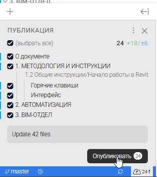

Для взаимодействия вашей локальной копии репозитория Git предназначена Git-панель, расположенная в нижнем левом углу рабочего пространства каталога:

{width=575px height=33px}

В данной панели отображается:

-  Название текущей **ветки** (`master`).

-  просмотр изменений.

-  Несколько кнопок, в зависимости от актуальности и внесенных изменений: 

   -  **Синхронизация** (иногда значок двух круговых стрелок) - для обновления вашего репозитория:

   {width=417px height=100px}

   

   -  **Вытянуть** (Pull, стрелка вниз) - для получения внесенных изменений в ваш репозиторий из центрального хранилища: 

   

   -  **Отправить** (Push, стрелка вверх) - для отправки внесенных изменений из вашего репозитория в центральное хранилище 

{width=308px height=348px}

rfr gjkexbmn bpvtytybz c gjhnfkf

как отправить изменения на портал

как обновляется информация на портале?