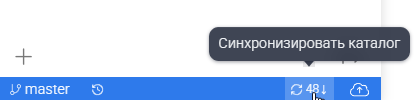

## GIT-панель

Для взаимодействия вашей локальной копии репозитория Git предназначена Git-панель, расположенная в нижнем левом углу рабочего пространства каталога:

{width=575px height=33px}

В данной панели отображается:

-  Название текущей **ветки** (`master`).

-  просмотр изменений.

-  Несколько кнопок, в зависимости от актуальности и внесенных изменений, про которые расскажем подробнее ниже.

### **Что такое ветка и почему мы всегда работаем в** master?

**Ветка** в Git -- это как отдельная линия разработки. Представьте, что вы пишете книгу: основная линия -- это `master` (или `main`). В ней лежит самый свежий и согласованный вариант документации. Все правки, которые вы делаете, по умолчанию попадают именно в эту ветку.

:::info 

В [Gram.ax](http://Gram.ax) мы всегда работаете в одной ветке -- master. Это сделано для простоты:  не нужно разбираться в сложном ветвлении.

:::

### Вытянуть

Вытянуть (Pull, стрелка вниз) - для получения внесенных изменений в ваш репозиторий из центрального хранилища:

**Зачем нужна:**

Забрать свежие изменения из удалённого репозитория (например, с GitHub) к себе на компьютер. Это нужно, если кто-то из коллег уже что-то исправил или добавил, пока вы работали.

**Когда нажимать:**

-  Всегда **перед тем, как начать писать**, если вы работаете в команде.

-  Если [Gram.ax](http://Gram.ax) показывает, что удалённая ветка опережает вашу локальную.

-  Просто по привычке раз в день, чтобы быть в курсе последних правок.

**Что происходит:**

[Gram.ax](http://Gram.ax) скачивает все изменения, которые есть на сервере, и объединяет их с вашими локальными файлами. Если правки не пересекаются, всё происходит автоматически. Если вы с коллегой правили один и тот же абзац -- может возникнуть **конфликт**. Об этом мы расскажем ниже.

### Отправить

Отправить (Push, стрелка вверх) - для отправки внесенных изменений из вашего репозитория в центральное хранилище.

{width=308px height=348px}

**Зачем нужна:**

Отправить ваши локальные изменения (то, что вы написали или исправили) в удалённый репозиторий, чтобы они стали доступны коллегам или просто сохранились на сервере.

**Когда нажимать:**

-  После того как вы закончили писать или править и убедились, что всё работает.

-  Перед тем как уйти с работы, чтобы ваши правки не остались только на локальном компьютере.

-  Всегда **после того, как вы сделали Pull** (если вы работаете не один).

**Что происходит:**

Все ваши коммиты (сохранённые изменения) загружаются на сервер. Теперь другие участники команды могут их вытянуть.

### Синхронизация

Синхронизация (иногда значок двух круговых стрелок) - для обновления вашего репозитория до состояния центрального хранилища:

{width=417px height=100px}

**Зачем нужна:**

Это «умная» кнопка, которая делает сразу два действия: сначала **вытягивает (pull)** изменения с сервера, а затем **отправляет (push)** ваши локальные. Это удобно, когда вы уверены, что конфликтов не будет, или просто хотите быстро обновить всё и сразу.

**Когда нажимать:**

-  Если вы работаете в одиночку и просто хотите «залить» свои правки на сервер и заодно проверить, нет ли там чего-то нового.

-  Если вы точно знаете, что за время вашей работы никто другой не менял те же файлы.

**Важно:** Если на сервере есть изменения, которые конфликтуют с вашими, синхронизация может остановиться и попросить вас разрешить конфликт вручную. В таком случае лучше сначала сделать отдельный Pull, разобраться с конфликтами, а потом Push.

## **Что делать, если возник конфликт?**

Конфликт возникает, когда вы и ваш коллега правили одну и ту же строку или один и тот же абзац. Git не может решить, чей вариант оставить.

[Gram.ax](http://Gram.ax) покажет вам такие файлы с пометкой «Конфликт». Вам нужно будет вручную выбрать, какой вариант оставить (ваш, коллеги или объединить их). Это похоже на сравнение двух версий текста: слева -- ваша, справа -- чужая, а посередине -- результат. Просто кликайте на нужные фрагменты и сохраняйте.

После разрешения конфликта не забудьте снова сделать **Commit** (сохранение) и затем **Push**.

## **Почему важно синхронизироваться?**

Если вы не будете нажимать **Pull** перед началом работы, вы рискуете:

-  Потерять правки коллег (они не отобразятся у вас локально).

-  При попытке отправить свои изменения получить ошибку, потому что сервер «убежал» вперёд.

Если вы не будете нажимать **Push** после работы, ваши правки:

-  Останутся только на вашем компьютере.

-  Не будут видны коллегам.

-  Могут быть утеряны при поломке компьютера.

:::info 

Так что лучше сделать лишний клик, чем потом восстанавливать тексты.

:::